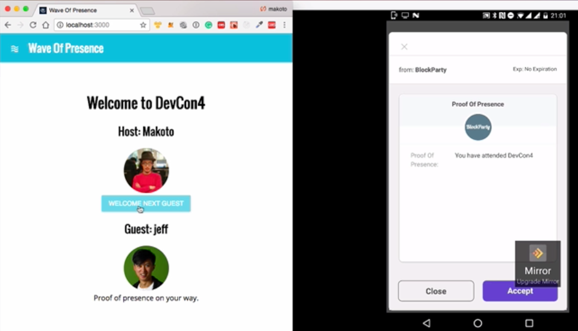

# Wave of Presence

"Web of Trust" style event check in system.

During meetups and parties, check in process tends to be the bottleneck as there are way more participants than organisers.

"Wave of Presence" is a blockchain based online check in system where you can delegate the check in capability into participants as volunteers so that you can make check in process more efficient.

NOTE: "[Web Of Trust](https://en.wikipedia.org/wiki/Web_of_trust)" is a concept used in PGP, GnuPG, and other OpenPGP-compatible systems to establish the authenticity of the binding between a public key and its owner in decentralised manner.

## Motivation

I have an event registration Dapp called [BlockParty](http://www.noblockno.party) where it takes deposit and distribute it among participants to incentivize event turn ups.

The Dpp has been used to manage real event (eg: DevCon social party and local meetups such as Ethereum London) on mainnet, though check in process is still manual and building a custom blockchain based Dapp faces the following problems.

- Manually looking up names (either by paper or by spreadsheet) is still error prone. As deposits are at stake, it needs to minimise the error rates. It requires an easily scannable QR code like solution.
- The majority of Blockchain wallet (mostly metamask) identities are tied into each browser on a physical machine, hence we cannot reuse single laptop among multiple volunteers who help check in process.
- Mobile wallet (such as LETH, Toshi, ImToken, and Status.im) are available but it will take time to setup (especially mnemonic generation phase). The volunteers who help check in process at Ethereum London (mostly university students) have different skill level about blockchain and educating each volunteers in advance is difficult.
- Self check in through shared QR code (which is the way UPort team demonstrated during Ethereal and DevCon3) is a weak way as people can easily share the QR code through social media.

## Demo

- [YouTube video](https://youtu.be/P3ayfYF7dVU)

## FAQ

### What does Uport provide to solve these problems?

- Built in QR generator / scanner to easily scan participants identity.
- Portable identity which minimises setup time to interact with Dapps.
- Attestation to issue a proof of  presence of the event.
- An ability to send transaction to blockchain so that it can add additional permission management through smart contract.

### What does Uport not provide?

P2P verification. I was initially considering using Uport attestation (in stead of smart contract) to manage permission control. However the current Uport APIs are mostly focused on server side attestation and verification so it turned out that it was not suitable for tis use case.

### How viable as a product or feature?

I created so that I can use to manage local event along side with BlockParty.

The checkin process does not handle crypto currency so it can be used for real even when Uport is not deployed in mainnet. All I have to write is an additional function to attest the link between mainnet ethereum address UPort Linkeby address.

## Why `Wave` not `Web`?

I came up with the idea while I was on a  beach in Vietnam :-)

## Dev

Install libraries.

`npm install`

### Runnig test (against testrpc)

`truffle test`

### Deploying your own smart contract

- Copy&paste the `contracts/WaveOfPresence.sol` contract into `remix.ethereum.org`.
- Point node to `rinkeby`
- When creating contract, add your Uport Network id as a input argument (this will allow you to be the first host).
- Once the contract is created, update the contract address at `src/contractSetup.js`.

#### Start the server

`npm run start`

### Used Libraries.

- [Truffle](http://truffleframework.com) = for general framework
- [Truffle React](http://truffleframework.com/boxes/react) box for boilerplate
